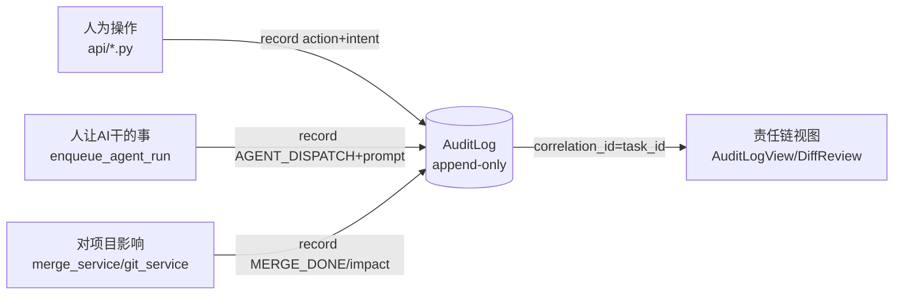
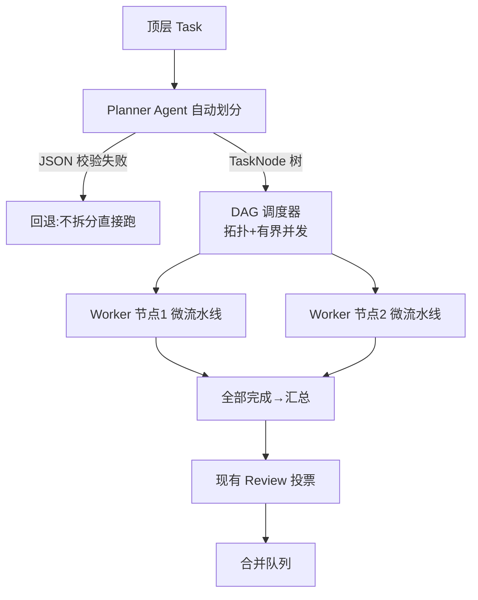

## 用户需求

在现有多 Agent 协作代码生成与审查平台基础上，规划两项大的功能更新，并形成可落地的设计计划（本期仅规划，不写文档、不落地代码）。

## 产品概述

- **功能一 · 全链路审计与责任划分**：建立 Append-only 审计账本，串联三类事件——人为操作（通过/驳回/转让/删成员/改配置等）、人让 AI 干的事（创建任务、派发指令、驳回反馈）、AI 对项目的影响（合并、冲突自动解决、文件变更）。用 correlation_id（顶层 task_id，嵌套后下探 task_node_id）把"谁发起—谁批准—AI 按什么指令执行—最终影响什么"串成可追责链。
- **功能二 · Agent 嵌套子 Agent + 任务自动划分**：引入 Planner（规划者）角色，把一个大任务自动拆成带依赖关系（DAG）的子任务树，由多个 Worker Agent 在有界并发下并行执行，子节点仍走现有"生成→审查→安全→汇总"微流水线；顶层 Task 的 11 态状态机、投票审查、合并队列闭环保持不变。

## 核心特性

- 审计：统一埋点 `audit_service.record(...)`（模仿 `message_service.push` 薄插入，try/except 不影响主流程）；按项目/操作人/动作/时间筛选的前端审计视图；版本/审查页一键查看"责任链"。
- 嵌套：新增 `TaskNode`（任务分解树，含 parent_node_id/depends_on DAG/assigned_agent_id/status）与 `SubAgentRun`（子 Agent 执行记录，含 prompt_snapshot/token_usage 供审计与可视化）；Planner 输出做结构化 JSON 校验，失败回退"不拆分直接跑"；复用 `execution_service` 有界并发与 `git_service` worktree 隔离。
- 协同：两期串行，先审计（低成本高价值）后嵌套；嵌套后审计链自动下探到 task_node_id，做到"哪个子任务、哪个 Agent、谁派发、影响哪些文件"全可追。

## 技术栈

- 后端：FastAPI + SQLAlchemy/SQLite（沿用）；新增 `services/audit_service.py`、`services/planner_service.py`、`services/dag_scheduler.py`；模型新增 `AuditLog`、`TaskNode`、`SubAgentRun`。
- 前端：Vue3 + TS + Pinia + TDesign（沿用）；新增 `AuditLogView.vue` 与 `audit.ts` store；改造 `PipelineStepper.vue`、`TaskTimeline.vue`、`TaskListView.vue`、`DiffReviewView.vue`、`VersionHistoryView.vue`。

## 实现策略

- **审计优先、低侵入**：所有业务写操作成功后调用 `audit_service.record(...)`，与现有 `message_service.push` 同模式（独立 Session、try/except 包裹、不阻塞主流程）。人工操作埋点在 `api/*.py`；AI 派发在 `execution_service.enqueue_agent_run` 记 `intent`；影响在 `merge_service`/`git_service` 提交与冲突解决后记 `impact`。
- **嵌套子 Agent 复用现有底座**：Planner 是一个高能力 Agent（`Agent` 表加 `is_planner` 标志），读任务描述产出 `TaskNode` 树（JSON 校验）；`dag_scheduler` 复用 `execution_service` 的 `ThreadPoolExecutor` + 项目锁做拓扑调度；每个 `TaskNode` 在顶层 task worktree 内以子目录隔离运行微流水线（复用 `_run_agent_pipeline` 的 node 适配）。顶层 Review/Merge/Voting 完全不改。

## 架构设计

### 全链路审计数据流



### 嵌套子 Agent 执行流



## 实现要点（防回退）

- **审计不影响主流程**：`audit_service.record` 始终独立 Session 并吞掉异常；配置 `AUDIT_ENABLED` 默认 true，可关闭。
- **日志膨胀控制**：`payload` 仅存结构化摘要（变更前后关键字段/参数），不存大文本；后续再考虑归档。
- **划分稳健性**：Planner 输出必须合法 JSON 节点树，超 `MAX_SUBTASKS` 截断、深度超 `NESTING_MAX_DEPTH` 不再嵌套；校验失败整体回退单流水线。
- **并发安全**：子节点调度复用 `execution_service` 有界池与项目锁，避免新增无界线程。
- **向后兼容**：顶层 `Task` 状态机、投票、合并队列零改动；不开启自动划分的任务行为完全不变。

## 目录结构与改动清单

```
backend/app/
├── models/models.py              # [MODIFY] 新增 AuditLog + AuditAction 枚举；新增 TaskNode、SubAgentRun；Agent 增加 is_planner 字段
├── core/config.py                # [MODIFY] 新增 AUDIT_ENABLED、MAX_SUBTASKS、NESTING_MAX_DEPTH
├── main.py                       # [MODIFY] 注册 audit_router
├── services/
│   ├── audit_service.py          # [NEW] record(*,actor_id,actor_type,action,project_id,task_id,task_node_id,intent,payload,impact) 薄插入
│   ├── planner_service.py        # [NEW] run_planner(task_id):调用 Planner Agent 产出 TaskNode 树并落库，含 JSON 校验/回退
│   ├── dag_scheduler.py          # [NEW] schedule_task_nodes(task_id):拓扑排序+有界并发，复用 execution_service 池
│   ├── execution_service.py      # [MODIFY] enqueue_agent_run 入口记 AGENT_DISPATCH(intent)；暴露节点执行入口给 dag_scheduler
│   ├── agent_runner.py           # [MODIFY] 支持 node 作用域执行；写 SubAgentRun(prompt_snapshot/token_usage)；每阶段审计
│   └── merge_service.py          # [MODIFY] 合并完成/冲突自动解决后记 impact 审计
├── api/
│   ├── audit.py                  # [NEW] GET /api/audit (筛选 project/actor/action/task) + GET /api/audit/chain?task_id=
│   ├── tasks.py                  # [MODIFY] create/start/stop/resume/archive/batch-delete 加审计；TaskCreate 增 decompose 标志；start 触发 planner
│   ├── reviews.py                # [MODIFY] vote/approve/reject/close/configure_reviewers 加审计(intent=feedback)
│   ├── members.py                # [MODIFY] add/remove/transfer/approve-join/reject-join 加审计
│   └── settings.py               # [MODIFY] 配置变更加审计(intent=变更项)
frontend/src/
├── api/index.ts                  # [MODIFY] 增加 audit 相关请求方法
├── stores/audit.ts               # [NEW] 审计列表/责任链状态
├── views/AuditLogView.vue        # [NEW] 审计日志列表(筛选:项目/操作人/动作/时间)+责任链时间线
├── views/TaskListView.vue        # [MODIFY] 创建任务增加"自动划分"开关(decompose)
├── views/DiffReviewView.vue      # [MODIFY] 增加"责任链"面板(按 task_id 拉审计链)
├── views/VersionHistoryView.vue  # [MODIFY] 版本行点击查看合并责任链
├── components/PipelineStepper.vue# [MODIFY] 升级为任务分解树/图视图(含 TaskNode 状态)
├── components/TaskTimeline.vue   # [MODIFY] 子节点甘特展示
└── router/index.ts               # [MODIFY] 新增 /audit 路由
```

## 关键代码结构

```python
class AuditAction(str, Enum):
    TASK_CREATE = "task_create"; TASK_START = "task_start"; TASK_STOP = "task_stop"
    TASK_RESUME = "task_resume"; TASK_ARCHIVE = "task_archive"; TASK_DELETE = "task_delete"
    AGENT_DISPATCH = "agent_dispatch"; REVIEW_VOTE = "review_vote"
    REVIEW_APPROVE = "review_approve"; REVIEW_REJECT = "review_reject"; REVIEW_CLOSE = "review_close"
    TRANSFER_OWNER = "transfer_owner"; MEMBER_ADD = "member_add"; MEMBER_REMOVE = "member_remove"
    JOIN_APPROVE = "join_approve"; JOIN_REJECT = "join_reject"
    CONFIG_UPDATE = "config_update"; MERGE_DONE = "merge_done"
    CONFLICT_AUTO_RESOLVED = "conflict_auto_resolved"; NODE_DISPATCH = "node_dispatch"

class AuditLog(Base):
    id; actor_id; actor_type  # human/agent/system
    project_id; task_id; task_node_id  # correlation_id 下探
    action; target_type; target_id
    intent; payload  # JSON 摘要; impact  # 文本/JSON
    created_at  # 只追加不可变

class TaskNode(Base):
    id; task_id; parent_node_id  # 顶层为 NULL
    title; description; assigned_agent_id
    status  # pending/running/done/failed/blocked
    depends_on  # JSON 兄弟节点 id 列表(DAG)
    result_summary; created_at; completed_at

class SubAgentRun(Base):
    id; task_node_id; agent_id; runner_type
    prompt_snapshot; started_at; finished_at; token_usage
```

## 验收标准

- **审计**：任意人为操作/AI 派发/合并均能在 `AuditLogView` 按筛选查到；给定 task_id 可在审查/版本页还原完整责任链；审计失败不影响主流程。
- **嵌套**：开启"自动划分"的大任务被 Planner 拆成 DAG 子任务并行执行，前端树视图与甘特正确展示；关闭时行为与现版完全一致；Planner 异常时回退单流水线；子节点审计链可下探到 task_node_id。

## 设计风格

沿用现有 TDesign 明亮简洁企业风，新增审计视图与嵌套流水线可视化。审计页采用"筛选工具栏 + 责任链时间线"布局，突出可追溯性；流水线步骤条升级为可折叠的"任务分解树"，节点用状态色区分。

## 页面规划

- **AuditLogView（审计中心）**：顶部筛选栏（项目/操作人/动作/时间范围）+ 列表表格（操作人、动作、目标、意图摘要、时间、影响）+ 点击行展开"责任链时间线"（按 correlation_id 串联三类事件）。
- **DiffReviewView / VersionHistoryView 责任链面板**：在右侧或底部新增"责任链"区块，展示该版本/审查对应的"谁发起→谁批准→AI 指令→合并影响"纵向时间线，关键节点可点击跳转。
- **PipelineStepper 任务分解树**：原顺序步骤条改为树形（Planner 根 → 子任务节点 → 各自微流水线阶段），节点状态用色块（运行=蓝/完成=绿/失败=红/阻塞=橙）。
- **TaskListView 创建任务**：任务表单新增"自动划分"开关，开启后由 Planner 自动拆子任务。

## 交互

- 审计列表支持按动作类型彩色标签；责任链时间线 hover 显示 payload 摘要。
- 流水线树支持折叠/展开，子节点并行态用微动画表示。
- 关键操作（转让/删除/通过）确认弹框内显式展示"将记录的操作意图"，强化留痕心智。