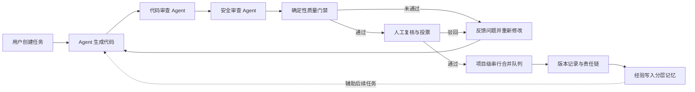

# AgentCollab 项目痛点、创新点与特色答辩报告

> 文档用途：项目答辩、创新评审、项目汇报参考  
> 项目定位：**面向企业研发场景的可控、可审、可追溯、可回退的多 Agent 协作治理平台**  
> 核心主张：**不是让 AI 绕过研发流程，而是让 AI 安全地进入研发流程。**

---

## 一、项目概述

AgentCollab 是一个面向团队软件研发的多 Agent 代码生成、审查与治理平台。

用户提交研发任务后，平台将代码生成、代码审查、安全审查、质量验证和结果汇总交给不同角色的 Agent 协同完成；所有代码修改都在隔离的 Git 工作树中进行，经过确定性质量门禁和人工审批后，才会进入串行合并队列。系统同时记录任务、执行、审查、投票、合并和版本信息，并将有效经验沉淀到分层记忆系统中。

平台形成如下闭环：



一句话概括：

> AgentCollab 将“AI 写代码”升级为“AI 在受控研发流程中协同交付代码”。

---

## 二、项目要解决的核心痛点

### 痛点一：通用 AI 编程工具偏重个人效率，缺少团队级治理

普通 AI 编程助手通常解决“如何更快生成代码”，但企业真正关心的还包括：

- 谁提出了任务；
- AI 修改了哪些文件；
- 修改基于什么上下文；
- 代码经过了哪些检查；
- 谁进行了复核和批准；
- 出现问题后如何定位、恢复和追责。

当任务、代码、审查、审批和版本记录分散在不同工具中时，AI 生成的代码很难直接进入严格的企业研发流程。

**项目解决方式：**将任务管理、Agent 执行、代码 Diff、自动门禁、多人复核、合并、版本和审计信息串联为一条完整责任链。

### 痛点二：单一 Agent 既生成又自审，容易形成判断偏差

如果由同一个模型完成需求理解、代码生成、质量判断和安全判断，容易出现“自己证明自己正确”的问题。模型输出本身具有概率性，同一风险也可能在不同轮次得到不同结论。

**项目解决方式：**将代码生成、代码审查、安全审查和报告汇总拆分为不同 Agent 角色，形成职责分离和交叉检查，再由人工做最终决策。

### 痛点三：AI 审查有语义能力，但缺少确定性的合并依据

AI 擅长理解业务语义和发现复杂逻辑问题，但不能把“模型认为没有问题”等同于“代码已经满足交付标准”。如果测试没有运行、扫描工具缺失或覆盖率不达标，仅靠自然语言报告仍可能产生错误放行。

**项目解决方式：**在人工批准之前执行阻断型质量门禁，包括：

1. 单元测试；
2. 代码格式与规范检查；
3. 静态安全扫描；
4. 硬编码密钥扫描；
5. 依赖漏洞检查；
6. 测试覆盖率检查；
7. 企业内部禁止项检查。

门禁采用“失败关闭”思路：必需检查未执行、未配置或未通过时，不把它展示为成功，也不允许进入正常合并流程。

### 痛点四：并行任务容易互相覆盖，后合并任务容易持续冲突

多个任务直接在同一工作目录或同一分支修改代码，会造成文件覆盖、状态污染和合并冲突。尤其当任务一先合并后，任务二仍基于旧版本继续合并时，简单重复执行并不能真正解决冲突。

**项目解决方式：**

- 每个顶层任务使用独立 Git 分支和工作树；
- 不同任务可以并行执行，互不污染；
- 审批通过后进入项目级串行合并队列；
- 合并前重新校验目标提交和质量门禁证据；
- 基线变化导致冲突时，将最新主分支合入任务工作树；
- 保留冲突现场并交给冲突解决流程处理，而不是无意义地重复整个任务；
- 冲突解决后重新进入合并队列。

### 痛点五：研发经验分散，同类错误反复出现

项目规范、历史缺陷、审查意见和架构决策往往散落在文档、聊天记录和个人经验中。Agent 每次都从零开始理解项目，会增加上下文成本，也容易重复历史错误。

**项目解决方式：**建立四层分层记忆：

| 层级 | 作用范围 | 主要内容 |
|---|---|---|
| 任务记忆 | 当前任务 | 当前任务的上下文、进度、错误和决策 |
| Agent 记忆 | 指定 Agent | 该 Agent 的历史经验、常见错误和行为偏好 |
| 项目记忆 | 当前项目 | 项目架构、规范、历史审查结论和公共经验 |
| 全局记忆 | 跨项目 | 可复用的通用开发模式和安全经验 |

系统支持语义检索、重复内容抑制、容量控制和确定性压缩摘要，避免记忆只增不减、噪声持续累积。持久记忆还可以在前端检索和检阅。

### 痛点六：AI 执行过程黑盒，用户只能等待结果

长时间任务如果缺少阶段、日志和状态反馈，用户无法判断系统是在正常执行、等待资源还是已经失败。页面刷新还可能造成上下文丢失。

**项目解决方式：**

- 通过 WebSocket 推送任务进度、流水线阶段、代码预览、门禁结果和审查状态；
- 将关键进度保存在共享状态中，降低页面切换造成的信息丢失；
- 页面使用缓存、首轮预加载和动态加载反馈改善连续操作体验；
- 消息中心支持按项目、任务、审查和具体消息进行精确跳转；
- 团队聊天支持实时消息、未读提示、历史分页、断线补拉和私聊隔离。

### 痛点七：安全、权限和敏感数据问题可能阻碍 AI 落地

企业代码可能包含账号、密钥、客户信息和内部配置。如果缺少权限隔离、敏感数据保护和操作留痕，AI 能力越强，潜在影响范围也越大。

**项目解决方式：**

- JWT 身份认证和项目成员权限校验；
- 项目负责人、管理员、普通成员、安全复核人和审计人员等角色分工；
- 模型调用前进行手机号、证件号、银行卡号、密钥等敏感信息识别与脱敏；
- 严格模式下可阻断无法安全处理的敏感内容；
- 系统设置中的密钥字段脱敏展示；
- 聊天、文件、审查和项目接口执行成员级授权；
- 关键操作写入追加式审计记录。

---

## 三、痛点、方案与价值对应关系

| 研发痛点 | AgentCollab 方案 | 直接价值 |
|---|---|---|
| AI 工具缺少团队治理 | 全流程任务与责任链 | AI 变更有入口、有过程、有出口 |
| 单模型自我审查偏差 | 多 Agent 职责分离 | 从不同角度交叉检查 |
| AI 结论不够确定 | 七项阻断型质量门禁 | 用可执行证据约束合并 |
| 并行修改相互污染 | Git 分支与 Worktree 隔离 | 支持安全并行开发 |
| 后合并任务持续冲突 | 串行合并队列与冲突交接 | 避免无意义重复执行 |
| 审查依赖个人经验 | 四层语义记忆与技能库 | 让经验跨任务、跨项目复用 |
| 执行过程不可见 | WebSocket 实时进度与消息中心 | 降低等待焦虑和沟通成本 |
| 高风险变更审批不足 | 风险评分与动态审批 | 风险越高，复核要求越严格 |
| 问题发生后难以恢复 | Git 版本记录与回退 | 缩短故障恢复路径 |
| 敏感信息可能外发 | 敏感数据守卫与权限控制 | 降低数据泄露风险 |

---

## 四、项目核心创新点

### 4.1 从“AI 编码工具”转向“AI 研发治理平台”

项目最重要的创新不是简单增加模型数量，而是改变 AI 在研发流程中的角色。

传统工具通常把 AI 放在开发人员的编辑器旁边；AgentCollab 将 AI 放入任务、权限、审查、门禁、审批、合并和审计组成的治理流程中。AI 可以提高生产效率，但不能绕过关键控制点。

这一设计实现了两个目标的统一：

- **效率目标：**自动生成、自动审查、自动汇总和自动反馈；
- **风险目标：**隔离执行、确定性门禁、人工决策、审计留痕和版本回退。

### 4.2 多 Agent 职责分离与协同流水线

平台按照研发岗位思路设计 Agent，而不是让一个 Agent 承担所有职责。

| Agent 角色 | 关注重点 |
|---|---|
| 代码生成 Agent | 需求理解、方案设计、代码实现 |
| 代码审查 Agent | 正确性、可维护性、规范和潜在缺陷 |
| 安全审查 Agent | 注入、越权、敏感信息、危险配置 |
| 汇总 Agent | 合并意见、去重、分级和形成结构化报告 |

其创新价值在于：

- 生成与审查职责分离；
- 质量与安全视角分离；
- 不同意见可以被统一汇总；
- 每个角色可以独立选择执行引擎、模型和技能；
- 流程可以扩展新的专业 Agent。

### 4.3 “AI 语义审查 + 确定性工具 + 人工审批”三层防线

这是项目区别于普通 AI 编程助手的关键机制。

```text
第一层：AI 语义审查
识别业务逻辑、设计合理性、复杂安全问题

第二层：确定性质量门禁
运行测试、覆盖率、静态扫描、密钥扫描和内部规则

第三层：人工审批
结合业务背景、风险等级和审查证据作最终决策
```

三层防线相互补充：

- AI 能理解复杂语义，但输出具有概率性；
- 工具检查结果确定，但难以理解完整业务意图；
- 人工拥有责任和业务判断，但不适合重复执行机械检查。

平台将三者组合，避免把任何一种能力绝对化。

### 4.4 面向并行研发的任务隔离与串行集成

平台将“任务执行并行化”和“主分支集成串行化”分开处理：

- 执行阶段：不同任务在独立工作树中并行；
- 审查阶段：每个任务基于固定提交生成 Diff 和证据；
- 集成阶段：同一项目的合并请求按队列串行处理；
- 冲突阶段：将最新基线带入任务分支，保留冲突现场并专项解决；
- 合并阶段：再次校验质量门禁对应的提交未被替换。

这种设计既提高了并行效率，又避免多个 Agent 同时写入主工作区造成不可预测状态。

### 4.5 可压缩、可检索、可检阅的四层记忆

许多 Agent 系统只有一段会话上下文，任务结束后经验便难以复用。AgentCollab 将记忆设计成不同作用域，并控制记忆生命周期。

创新点包括：

- 当前任务上下文与长期经验分开；
- Agent 个人经验与项目公共知识分开；
- 项目经验与跨项目通用模式分开；
- 基于语义相关度按层检索；
- 对完全重复内容进行刷新而不是无限新增；
- 超出容量时生成确定性摘要并保留来源信息；
- 支持在前端查看持久记忆，便于人工纠错和治理。

这使系统具备“从历史审查和驳回反馈中持续改进”的基础。

### 4.6 风险驱动的动态审批

不同代码变更不应使用完全相同的审批要求。平台可以根据变更内容计算风险等级，例如：

- 是否涉及交易、账户、认证和权限模块；
- 是否修改数据库结构；
- 是否新增依赖；
- 修改文件数和代码规模；
- 是否存在高危安全发现；
- 自动化测试和覆盖率是否充分。

低风险变更可以采用较轻审批，高风险变更要求更多复核人员和安全角色参与，严重风险可禁止常规自动合并。

这种机制把审批强度与实际风险关联起来，兼顾效率与安全。

### 4.7 以提交快照和证据为核心的可信审查

平台不只保存一段自然语言报告，还将审查与具体 Git 提交绑定：

- 保存受审提交哈希；
- 记录变更文件和 Diff；
- 生成文件内容摘要及工作树一致性信息；
- 保存质量门禁状态、输出、耗时和失败原因；
- 合并前验证通过门禁的提交是否仍是当前提交。

因此，人工批准的是一个明确、可核验的代码快照，而不是一个可能已经变化的工作目录。

### 4.8 面向企业场景的敏感数据外发守卫

在调用模型之前对 Prompt 中的敏感内容进行识别和处理，将安全控制放在数据离开系统之前，而不是仅依赖事后审计。

该机制支持：

- 手机号、证件号、银行卡号和邮箱脱敏；
- API Key、密码、JWT 和私钥识别；
- 对高风险内容进行严格阻断；
- 记录脱敏或阻断行为；
- 适配外部模型和未来的内网私有模型。

---

## 五、项目主要特点

### 5.1 可控

- AI 只能在授权项目和隔离工作树内执行；
- 未通过质量门禁的代码不能正常批准；
- 高风险变更提高审批门槛；
- 主分支合并由受控队列执行。

### 5.2 可审

- 人工可查看代码 Diff、审查报告、安全发现和门禁输出；
- 每项审查对应明确提交；
- 支持多人投票、驳回反馈和重新检查；
- 区分“代码问题”和“平台环境问题”，避免错误地让 Agent 重复修改。

### 5.3 可追溯

- 任务、Agent、审查、投票、门禁、合并和版本相互关联；
- 消息中心能够跳转到对应项目、任务、审查或聊天消息；
- 审计中心记录关键操作的人员、时间、对象和影响。

### 5.4 可回退

- 每次成功合并形成版本记录；
- 可以定位变更对应的任务和审查；
- 支持通过 Git 生成可审计的回退版本；
- 降低问题版本的恢复成本。

### 5.5 可学习

- 驳回意见、审查结论和执行经验进入分层记忆；
- 后续任务可以语义检索相关经验；
- 技能库可以沉淀行业规范和审查清单；
- 记忆压缩避免长期运行后上下文失控。

### 5.6 可扩展

- 支持 CrewAI、Claude Code、OpenCode 等不同执行引擎；
- 支持 OpenAI 兼容模型接口和本地 CLI；
- Agent、技能、门禁命令和企业规则可以按场景配置；
- 后端采用 FastAPI，前端采用 Vue 3，模块边界清晰。

### 5.7 可观测

- WebSocket 实时展示执行进度和阶段；
- 风险驾驶舱汇总任务、审查、门禁、风险和成本指标；
- 团队聊天和消息中心承载协作通知；
- 加载状态、异常提示和断线补拉减少操作不确定性。

---

## 六、与普通 AI 编程工具的差异

| 对比维度 | 普通 AI 编程助手 | AgentCollab |
|---|---|---|
| 服务对象 | 个人开发者 | 项目团队和研发治理人员 |
| 核心目标 | 提高代码生成速度 | 在风险可控前提下提升交付效率 |
| 执行模式 | 单助手交互 | 多 Agent 分工流水线 |
| 代码空间 | 通常直接操作当前目录 | 任务级 Git 分支与 Worktree 隔离 |
| 审查机制 | 用户自行检查或模型自审 | 代码审查、安全审查、报告汇总 |
| 合并依据 | 对话结果或开发者判断 | 固定提交、门禁证据和人工投票 |
| 并行冲突 | 依赖人工处理 | 项目级合并队列和冲突解决流程 |
| 权限控制 | 通常较弱 | 身份、项目成员和角色权限 |
| 经验复用 | 当前会话上下文为主 | 四层记忆和可复用技能 |
| 过程可见性 | 结果导向 | 实时阶段、日志、消息和风险指标 |
| 故障恢复 | 依赖外部 Git 操作 | 平台内版本记录、责任链和回退 |

答辩时可以强调：

> Copilot 类工具解决“一个人如何更快写代码”，AgentCollab 解决“一个团队如何安全地使用 AI 交付代码”。

---

## 七、项目价值

### 7.1 对开发人员

- 减少重复编码和机械检查；
- 快速获得代码、安全和规范方面的反馈；
- 在隔离环境中尝试方案，降低误操作影响；
- 从项目历史经验和技能库中获取上下文。

### 7.2 对审查人员

- 先由 Agent 和自动化工具完成基础检查；
- 审查重点从逐行机械检查转向业务风险判断；
- 所有问题按严重程度汇总，减少意见整理成本；
- 可以查看门禁原始输出，而不是只看 AI 结论。

### 7.3 对项目负责人

- 统一查看任务、人员、Agent、进度、风险和版本；
- 通过审批策略控制不同风险的变更；
- 支持多个任务并行执行和有序合并；
- 通过驾驶舱观察交付效率和风险趋势。

### 7.4 对安全与审计人员

- 安全审查被前置到合并之前；
- 高风险变更可以强制安全角色参与；
- 敏感数据在模型调用前进行识别和处理；
- 可以沿责任链追溯需求、代码、审查、审批和版本。

---

## 八、典型应用场景

### 场景：银行转账查询接口安全改造

1. 用户创建“修复转账查询接口越权和敏感日志问题”任务；
2. 代码生成 Agent 在独立工作树中修改代码；
3. 代码审查 Agent 检查逻辑、异常处理和可维护性；
4. 安全审查 Agent 检查越权、SQL 注入和敏感数据泄露；
5. 确定性门禁运行测试、静态扫描、密钥扫描和银行禁止项检查；
6. 如果门禁失败，问题明细反馈给 Agent 重新修改；
7. 门禁通过后，高风险任务要求安全复核人参与审批；
8. 多人投票通过后，任务进入项目合并队列；
9. 合并成功后生成版本、消息和审计记录；
10. 审查结论沉淀为项目记忆，供相似任务复用；
11. 如上线后发现异常，可根据责任链定位并执行版本回退。

该场景可以一次性展示项目的代码生成、风险控制、协同审批、经验学习和故障恢复能力。

---

## 九、建议在答辩中展示的验证证据

答辩不应只展示界面，还应展示可以核验的工程证据：

| 证据 | 建议展示内容 |
|---|---|
| 任务隔离 | 两个任务同时运行但位于不同 Worktree |
| 审查证据 | 固定提交哈希、文件 Diff 和审查报告 |
| 门禁阻断 | 构造一个硬编码密钥或失败测试，展示禁止批准 |
| 反馈闭环 | 驳回后 Agent 根据具体问题重新修改 |
| 合并队列 | 两个审批通过任务按顺序集成 |
| 冲突处理 | 后任务基线过期后进入冲突解决而非无限重跑 |
| 记忆复用 | 新任务检索到之前的驳回经验 |
| 责任追踪 | 从审计记录跳转到任务、审查和版本 |
| 故障恢复 | 将项目回退到指定历史版本 |
| 工程质量 | 前端生产构建成功、后端自动化测试通过 |

当前工作区最近一次验证结果为：

- 前端 TypeScript 类型检查通过；
- 前端 Vite 生产构建通过；
- 后端自动化测试共 **75 项通过**；
- Git 差异完整性检查通过。

---

## 十、建议量化的项目成效

目前不应在没有真实对照实验的情况下宣称固定百分比收益。建议选取一组规模相近的任务，对比传统方式与平台方式。

| 指标 | 计算方法 | 证明目标 |
|---|---|---|
| 平均交付时间 | 任务创建至合并的平均时长 | 是否提高交付效率 |
| 人工审查投入 | 审查人员实际操作时长 | 是否减少重复劳动 |
| 首次通过率 | 首轮通过任务数 ÷ 总任务数 | 生成质量是否改善 |
| 门禁拦截量 | 合并前自动阻断问题数 | 自动控制是否有效 |
| 安全漏检率 | 复测发现但流程未发现的问题占比 | 安全能力是否改善 |
| 重复问题下降率 | 相同类型问题前后出现次数对比 | 记忆系统是否有效 |
| 冲突平均处理时间 | 冲突产生至重新入队的时长 | 合并机制是否有效 |
| 回退恢复时间 | 发现问题至恢复稳定版本的时长 | 故障恢复是否加快 |
| 单任务成本 | 模型、计算和人工投入之和 | 是否具备规模化价值 |

答辩时推荐使用“实测数据 + 样本数量 + 计算口径”，避免只展示没有来源的百分比。

---

## 十一、项目边界与后续方向

AgentCollab 当前适合定位为“完成关键治理闭环的创新原型”，不建议直接表述为已经满足所有生产要求。

面向生产环境仍可继续完善：

- 对接企业统一身份认证和组织架构；
- 对接内部 Git 平台、CI/CD 和安全扫描平台；
- 接入内网或私有化模型；
- 建立模型、Prompt 和技能版本治理；
- 使用 PostgreSQL、Redis 和对象存储替代单机型组件；
- 增强审计记录的哈希链、签名和外部归档；
- 建立敏感数据分类分级和模型调用白名单；
- 通过压力测试、故障演练和高可用部署验证稳定性；
- 使用真实试点任务完成效率与安全指标评估。

主动说明边界不会削弱项目价值，反而能够体现团队对工程落地和风险治理的清醒认识。

---

## 十二、答辩参考话术

### 30 秒版本

> AgentCollab 不是一个简单的 AI 写代码工具，而是一套多 Agent 研发协作与治理平台。它让代码生成、代码审查、安全审查和报告汇总由不同 Agent 分工完成，并通过独立 Git 工作树、七项确定性质量门禁、多人审批、串行合并队列和版本回退控制风险。同时，系统用四层记忆沉淀历史经验，用责任链记录每一次变更。我们的目标是在提高研发效率的同时，让 AI 生成的每一行代码都可控、可审、可追溯、可回退。

### 1 分钟版本

> 当前很多 AI 编程工具解决的是个人编码速度问题，但企业落地还面临过程不可控、审查证据不足、并行修改冲突、经验无法复用以及责任难以追溯等问题。  
>   
> AgentCollab 的解决思路，是把 AI 放进现有研发治理流程，而不是让 AI 绕过流程。每个任务首先在独立 Git 工作树中执行，再由代码审查 Agent 和安全审查 Agent 交叉检查；之后必须通过单元测试、静态扫描、密钥扫描、覆盖率等确定性门禁，最后由人工复核。审批通过的任务进入项目级串行合并队列，出现冲突时保留现场并专项处理。所有过程都与固定提交、审查证据、投票和版本记录关联，并通过四层记忆将有效经验复用于后续任务。  
>   
> 因此，我们的创新重点不是“用了多少个 Agent”，而是建立了一套让 AI 能够被企业安全使用的协作机制。

### 常见问题：与 Copilot 有什么区别？

> Copilot 更偏向个人开发者的编码辅助，AgentCollab 面向团队研发治理。我们不仅生成代码，还管理任务隔离、代码审查、安全门禁、多人审批、冲突处理、经验沉淀、责任追踪和版本恢复。

### 常见问题：如何保证 AI 生成代码安全？

> 我们不宣称 AI 可以百分之百发现问题，而是设计了三层防线：AI 负责语义审查，确定性工具运行测试和安全检查，人工结合业务背景作最终决策。任何一层发现阻断问题，代码都不能进入正常合并流程。

### 常见问题：多个任务同时修改代码怎么办？

> 每个顶层任务在独立 Git Worktree 中执行，所以生成阶段可以并行；审批通过后，同一项目通过串行队列逐个合并。后任务基线过期时会将最新主分支带入任务工作树，若产生冲突则保留现场交给冲突解决流程，而不是反复从头运行。

### 常见问题：项目是否已经达到生产级？

> 当前已经完成核心流程和技术可行性验证，具备任务隔离、审查门禁、审批合并、审计追溯、分层记忆和版本回退闭环。正式生产化还需要对接企业身份、代码仓库、内网模型和安全基础设施，并通过高可用和压力测试进一步验证。

---

## 十三、答辩结论

AgentCollab 所解决的不是单一的代码生成问题，而是 AI 参与企业研发之后产生的一整套治理问题。

项目通过：

- 多 Agent 职责分离；
- Git 任务级隔离；
- AI、工具和人工三层防线；
- 风险驱动审批；
- 项目级串行合并和冲突处理；
- 四层经验记忆；
- 全链路责任追踪；
- 版本记录与回退；

构建了从“任务提出”到“代码交付”，再到“经验沉淀”的完整闭环。

最终希望评委记住的不是“平台会自动写代码”，而是：

> **AgentCollab 让 AI 研发从个人效率工具，升级为团队可以管理、组织可以审计、风险可以控制的工程能力。**
