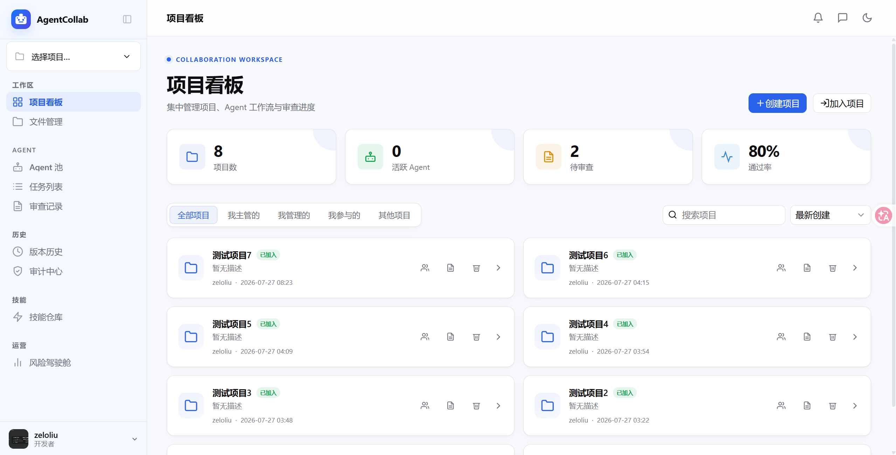

# AgentCollab — 多 Agent 研发协作与治理平台

> 面向团队研发场景的可控、可审、可追溯、可回退的多 Agent 协作平台。

AgentCollab 将 AI 代码生成纳入任务隔离、代码审查、安全检查、确定性质量门禁、人工审批、串行合并、审计追踪和版本回退组成的完整研发流程。项目的核心不是让 AI 绕过现有规范自动提交代码，而是让 AI 在受控边界内参与软件交付。



## 文档导航

- [项目痛点、创新点与特色答辩报告](AgentCollab项目痛点与创新点答辩报告.md)
- [银行创新项目演示引导](backend/DEMO_GUIDE.md)
- [后端运行与接口说明](backend/README.md)

## 核心流程

```text
创建任务
  → 独立 Git Worktree 中生成代码
  → 代码审查 + 安全审查 + 报告汇总
  → 七项确定性质量门禁
  → 人工复核与投票
  → 项目级串行合并队列
  → 版本记录、责任链与经验沉淀
```

1. **代码生成** — Agent 分析需求，在任务专属分支和工作树中修改代码。
2. **交叉审查** — 代码审查 Agent 和安全审查 Agent 分别检查质量与风险。
3. **确定性门禁** — 执行测试、代码规范、静态扫描、密钥扫描、依赖审计、覆盖率和内部规则。
4. **人工决策** — 根据风险等级进行多人复核；驳回意见会反馈给 Agent 重新修改。
5. **有序集成** — 审批通过后进入项目级合并队列；基线变化产生的冲突进入专项解决流程。
6. **持续治理** — 保存版本、审计和审查证据，并将有效经验写入分层记忆。

## 解决的痛点

| 痛点 | 平台方案 |
|------|----------|
| 通用 AI 编程工具缺少团队级治理 | 串联任务、执行、审查、审批、合并、版本和审计 |
| 单一 Agent 生成后自我审查 | 生成、代码审查、安全审查和汇总职责分离 |
| AI 报告缺少确定性合并依据 | 七项失败关闭型质量门禁与固定提交证据 |
| 多任务并行修改互相覆盖 | 每个顶层任务使用独立 Git Worktree |
| 后合并任务基线过期、反复冲突 | 项目级串行合并队列和冲突交接机制 |
| 历史经验分散、相同问题反复出现 | 任务、Agent、项目、全局四层记忆 |
| 长任务过程黑盒、页面切换丢进度 | WebSocket 实时推送和共享进度状态 |
| 敏感数据和高风险变更难以管控 | 数据脱敏、角色权限、风险评分和动态审批 |

## 核心创新

- **多 Agent 职责分离**：不同角色从实现、质量、安全和汇总角度交叉检查。
- **三层质量防线**：结合 AI 语义审查、确定性工具检查和人工审批。
- **并行执行、串行集成**：隔离工作树支持并行开发，项目级队列保证主分支有序更新。
- **提交级可信审查**：审查报告、Diff、门禁结果和文件摘要绑定到明确的 Git 提交。
- **四层长期记忆**：支持语义检索、去重、容量控制、确定性压缩和前端检阅。
- **风险驱动审批**：根据变更范围、安全发现和业务模块动态提高复核要求。
- **敏感数据外发守卫**：模型调用前识别、脱敏或阻断高风险内容。
- **全链路责任追踪**：将任务发起、AI 执行、人工投票、合并和回退关联起来。

与个人编码助手相比，AgentCollab 更关注“团队如何安全地使用 AI 交付代码”。完整的项目痛点、创新说明、答辩话术和量化指标建议见[答辩报告](AgentCollab项目痛点与创新点答辩报告.md)。

## 技术栈

### 后端

| 组件 | 技术 |
|------|------|
| Web 框架 | FastAPI (Python 3.12) |
| 数据库 | SQLite + SQLAlchemy ORM |
| 认证 | JWT (python-jose) + PBKDF2 密码哈希 |
| 实时推送 | FastAPI 原生 WebSocket |
| Git 操作 | GitPython |
| Agent 框架 | CrewAI / Claude Code CLI / OpenCode CLI |
| LLM | DeepSeek API（OpenAI 兼容协议） |
| 向量记忆 | ChromaDB（四层分层记忆系统） |

### 前端

| 组件 | 技术 |
|------|------|
| 框架 | Vue 3 (Composition API + `<script setup>`) |
| 语言 | TypeScript |
| 构建工具 | Vite 8 |
| UI 组件库 | TDesign Vue Next |
| 状态管理 | Pinia |
| 路由 | Vue Router 4 |
| 代码编辑器 | Monaco Editor |
| Markdown 渲染 | marked (GFM) |

## 项目结构

```
demo/
├── backend/                          # FastAPI 后端
│   ├── app/
│   │   ├── main.py                   # FastAPI 入口，路由注册，CORS
│   │   ├── api/
│   │   │   ├── auth.py               # 注册/登录 (JWT)
│   │   │   ├── projects.py           # 项目 CRUD + 文件管理 + 上传
│   │   │   ├── agents.py             # Agent CRUD + CLI 检测
│   │   │   ├── tasks.py              # 任务 CRUD + 后台触发流水线
│   │   │   ├── reviews.py            # 审查记录：通过/驳回反馈/结束
│   │   │   ├── versions.py           # 版本历史 + 回退
│   │   │   ├── chat.py               # 团队聊天、私聊和文件
│   │   │   ├── members.py            # 项目成员与角色权限
│   │   │   ├── messages.py           # 消息中心与阅读状态
│   │   │   ├── audit.py              # 全链路审计查询
│   │   │   ├── risk_dashboard.py     # 风险驾驶舱指标
│   │   │   ├── models.py             # LLM 模型列表查询
│   │   │   ├── settings.py           # 配置读写（.env） + 脱敏
│   │   │   └── ws.py                 # WebSocket 连接管理 + 广播
│   │   ├── core/
│   │   │   ├── config.py             # Pydantic Settings（.env 加载）
│   │   │   ├── database.py           # SQLAlchemy 引擎 + init_db()
│   │   │   └── auth.py               # 密码哈希 + JWT 编解码
│   │   ├── models/
│   │   │   └── models.py             # ORM：User, Project, Agent, Task, Review, Version
│   │   └── services/
│   │       ├── agent_runner.py        # Agent 流水线编排
│   │       ├── execution_service.py   # 有界执行队列与恢复
│   │       ├── merge_service.py       # 项目级串行合并与冲突交接
│   │       ├── quality_gate_service.py# 七项确定性质量门禁
│   │       ├── git_service.py         # Worktree/提交/Diff/证据/回退
│   │       ├── memory_service.py      # 四层记忆、检索和压缩
│   │       ├── risk_scoring_service.py# 风险评分与动态审批
│   │       ├── sensitive_data_guard.py# 模型调用前敏感数据保护
│   │       └── audit_service.py       # 追加式责任链记录
│   ├── agent_service/
│   │   ├── runners/
│   │   │   ├── base.py               # Runner 抽象基类 + RunResult
│   │   │   ├── factory.py            # Runner 工厂（根据 runner_type 分发）
│   │   │   ├── crewai_runner.py      # CrewAI 4-Agent 顺序流水线
│   │   │   ├── claude_runner.py      # Claude Code CLI（子进程调用）
│   │   │   ├── opencode_runner.py    # OpenCode CLI（子进程调用）
│   │   │   └── tool_adapters.py      # 公共工具适配层
│   │   └── tools/
│   │       ├── file_tools.py         # FileRead / FileWrite（工作区沙箱）
│   │       ├── git_tools.py          # GitDiff 工具
│   │       └── memory_tools.py       # 记忆检索 / 记录工具
│   ├── .env                          # 环境配置（不入仓库）
│   ├── .env.example                  # 配置模板
│   ├── requirements.txt              # Python 依赖
│   ├── data.db                       # SQLite 数据库（自动生成）
│   └── chroma_data/                  # ChromaDB 向量存储（自动生成）
├── frontend/                         # Vue 3 前端
│   ├── src/
│   │   ├── main.ts                   # Vue 应用入口
│   │   ├── App.vue                   # 根组件：侧边栏 + 顶栏 + 内容区
│   │   ├── style.css                 # 全局样式入口
│   │   ├── styles/
│   │   │   ├── tokens.css            # Design Tokens（亮色/暗色主题变量）
│   │   │   └── components.css        # 共享组件样式
│   │   ├── api/
│   │   │   └── index.ts              # Axios 实例 + 拦截器 + 错误处理
│   │   ├── router/
│   │   │   └── index.ts              # 路由定义 + 登录守卫
│   │   ├── stores/
│   │   │   ├── auth.ts               # 认证状态（token/用户信息）
│   │   │   ├── project.ts            # 项目状态（列表/当前项目/排序）
│   │   │   ├── websocket.ts          # WebSocket 连接 + 事件订阅
│   │   │   └── theme.ts              # 主题状态（亮色/暗色切换）
│   │   ├── utils/
│   │   │   └── markdown.ts           # Markdown 渲染（marked + GFM）
│   │   ├── components/
│   │   │   ├── ProjectSidebar.vue    # 项目列表侧边栏 + 系统设置入口
│   │   │   ├── ChatSidebar.vue       # 团队聊天、私聊、断线补拉
│   │   │   ├── MemoryExplorer.vue    # 分层记忆检索与检阅
│   │   │   ├── QualityGatePanel.vue  # 质量门禁证据面板
│   │   │   ├── MemberManager.vue     # 成员与角色管理
│   │   │   ├── FileTree.vue          # 文件树组件（递归渲染）
│   │   │   ├── MonacoEditor.vue      # Monaco Editor 封装（语法高亮）
│   │   │   ├── DiffViewer.vue        # 代码 Diff 查看器（分组/增删/行号）
│   │   │   ├── PipelineStepper.vue   # 流水线阶段步骤条
│   │   │   └── TaskTimeline.vue      # 任务执行时间线（甘特图风格）
│   │   └── views/
│   │       ├── LoginView.vue         # 登录/注册页
│   │       ├── DashboardView.vue     # 项目看板（统计卡片 + 项目网格）
│   │       ├── FileManagerView.vue   # 文件管理器（文件树 + 编辑器）
│   │       ├── AgentPanelView.vue    # Agent 池（创建/管理 Agent）
│   │       ├── TaskListView.vue      # 任务列表 + 详情 + 流水线 + 审查决策
│   │       ├── DiffReviewView.vue    # 审查记录（Diff + Markdown 报告）
│   │       ├── VersionHistoryView.vue# 版本历史 + 回退
│   │       ├── RiskDashboardView.vue # 风险和效能指标
│   │       ├── AuditLogView.vue      # 审计中心
│   │       ├── MessagesView.vue      # 消息中心
│   │       ├── SkillRepositoryView.vue# 技能仓库
│   │       └── SettingsView.vue      # 系统设置（API Key/端点/工作空间）
│   ├── package.json
│   └── vite.config.ts
├── workspaces/                       # 项目 Git 工作区（运行时生成）
├── AgentCollab项目痛点与创新点答辩报告.md
└── .gitignore
```

## 快速开始

### 环境要求

- **Python** 3.12+
- **Node.js** 18+
- **Git** 2.30+
- **DeepSeek API Key**（CrewAI 引擎使用）
- （可选）**Claude Code CLI** — 使用 `claude_code` 引擎时需要
- （可选）**OpenCode CLI** — 使用 `opencode` 引擎时需要

### 1. 启动后端

```bash
cd backend

# 创建虚拟环境
python -m venv .venv

# 激活虚拟环境
.venv\Scripts\activate     # Windows
# source .venv/bin/activate  # Linux/Mac

# 安装依赖
pip install -r requirements.txt

# 配置环境变量
cp .env.example .env
# 编辑 .env，设置 DEEPSEEK_API_KEY=sk-...

# 启动
python -m uvicorn app.main:app --host 0.0.0.0 --port 8000
```

后端启动后：
- API 文档：`http://localhost:8000/docs`
- WebSocket：`ws://localhost:8000/api/ws?token=<JWT>`

### 2. 启动前端

```bash
cd frontend

# 安装依赖
npm install

# 启动开发服务器
npm run dev
```

前端启动后访问 `http://localhost:5173`。

### 3. 系统设置

登录后，在侧边栏「系统设置」中配置：

| 设置项 | 说明 |
|--------|------|
| `DEEPSEEK_API_KEY` | DeepSeek API 密钥（CrewAI / OpenCode 引擎使用） |
| `ANTHROPIC_API_KEY` | Anthropic API 密钥（Claude Code 引擎使用） |
| `DEEPSEEK_BASE_URL` | DeepSeek API 端点（默认 `https://api.deepseek.com`） |
| `OPENCODE_SERVER_URL` | OpenCode 服务地址（默认 `http://localhost:36000`） |
| `WORKSPACE_ROOT` | 项目 Git 工作区根目录（默认 `../workspaces`） |

也可以在 `backend/.env` 中直接编辑，修改即时生效。

### 4. 基本使用流程

1. **创建项目** — 在项目看板点击「创建项目」，输入名称和描述
2. **管理成员** — 邀请项目成员，分配负责人、管理员、普通成员、安全复核人或审计角色
3. **创建 Agent** — 选择角色、模型、执行引擎和可复用技能
4. **创建任务** — 输入任务描述和审批策略，在独立工作树中启动执行
5. **查看进度** — 实时查看流水线阶段、运行日志、代码预览和质量门禁
6. **审查决策** — 查看固定提交对应的 Diff、审查报告和门禁证据：
   - **投票通过**：达到审批条件后进入项目合并队列
   - **驳回并修改**：填写具体反馈，Agent 在原任务工作树中继续修改
   - **结束审查**：终止任务并清理受控 Git 资源
7. **跟踪集成** — 查看排队、集成、冲突解决和合并结果
8. **追溯与复用** — 通过版本、审计、消息中心和分层记忆复用历史经验

## 环境变量

```bash
# ── 数据库 ──────────────────────────
DATABASE_URL=sqlite:///./data.db      # SQLite 数据库路径

# ── 认证 ────────────────────────────
JWT_SECRET=dev-secret-change-in-production
JWT_ALGORITHM=HS256
JWT_EXPIRE_MINUTES=1440               # Token 有效期（分钟）

# ── 工作空间 ────────────────────────
WORKSPACE_ROOT=../workspaces           # 项目 Git 仓库根目录

# ── LLM 配置 ────────────────────────
DEEPSEEK_API_KEY=sk-...               # DeepSeek API Key（必填）
DEEPSEEK_BASE_URL=https://api.deepseek.com
ANTHROPIC_API_KEY=                    # Anthropic API Key（Claude Code 使用）
OPENCODE_SERVER_URL=http://localhost:36000
```

## 执行引擎对比

| 特性 | CrewAI | Claude Code | OpenCode |
|------|--------|-------------|----------|
| 类型 | Python SDK（进程内调用） | CLI 子进程 | CLI 子进程 |
| LLM 后端 | DeepSeek | Anthropic Claude | 任意 OpenAI 兼容 API |
| 安装要求 | `pip install crewai` | `npm install -g @anthropic-ai/claude-code` | 安装 OpenCode CLI |
| 工具支持 | FileRead/Write, GitDiff, Memory | 原生文件编辑/Git/Bash | 原生文件编辑/Git/Bash |
| 适用场景 | 低成本快速验证 | 高质量代码生成 | 多模型灵活切换 |

创建 Agent 时会自动检测本地是否安装了对应的 CLI 工具，并可通过「检测模型」按钮验证 API Key 是否可用。

## Agent 流水线

```
代码工程师 (code_gen)
    │  根据任务描述，在隔离的 Git 分支上编写代码
    ▼
代码审查员 (reviewer)
    │  检查逻辑错误、命名规范、潜在 Bug、代码可读性
    ▼
安全审查员 (security)
    │  扫描注入攻击、越权访问、硬编码密钥等安全漏洞
    ▼
审查汇总员 (summarizer)
    │  整合审查意见 → 按严重程度排序 → Markdown 报告
    ▼
人工决策
    ├── 通过 → 进入项目级合并队列 → 创建版本记录
    ├── 驳回并修改 → Agent 根据反馈在同一分支重新执行
    └── 结束 → 丢弃变更 → 清理分支
```

## Git Worktree 隔离与合并队列

每个顶层任务在独立的 Git 分支和 Worktree 中执行：

```
主工作树（master）
├── project.worktrees/task-1  ← task/1
├── project.worktrees/task-2  ← task/2
└── project.worktrees/task-3  ← task/3
```

- 不同任务的文件、暂存区和运行状态互不污染；
- 独立任务可以并行运行，共享父任务工作树的子任务按父任务串行；
- 审批通过的任务按入队顺序进行项目级串行集成；
- 集成前验证质量门禁对应的提交没有被替换；
- 主分支变化产生冲突时，将最新基线合入任务工作树并保留冲突现场；
- 冲突解决完成后重新进入合并队列，不从头重复正常生成流程；
- 每次成功合并生成版本记录，支持后续追溯和回退。

## 确定性合并门禁

AI 完成代码生成和审查报告后，系统立即在任务隔离分支上执行七项阻断型检查。只有检查通过，界面和后端才允许人工投通过票：

| 检查 | 执行方式 | 未通过时 |
|------|----------|----------|
| 单元测试 | 管理员配置项目测试命令 | 阻止合并 |
| 代码格式与规范 | 内置语法、行尾空白、超长行检查，可扩展 lint 命令 | 阻止合并 |
| 静态安全扫描 | 内置 SQL 注入、命令注入规则，可扩展 SAST 命令 | 阻止合并 |
| 硬编码密钥扫描 | 内置私钥、访问密钥、凭据规则，可扩展密钥扫描命令 | 阻止合并 |
| 依赖漏洞检查 | 管理员配置依赖审计命令 | 阻止合并 |
| 测试覆盖率 | 管理员配置带阈值的覆盖率命令 | 阻止合并 |
| 银行内部禁止项 | 内置敏感文件及禁止文本规则，可扩展内部规则命令 | 阻止合并 |

执行顺序和合并条件为：

```text
AI 生成代码与审查报告
    → 七项确定性检查
        ├─ 代码失败：禁止投通过票 → 按失败项打回 Agent → 重新生成并检查
        ├─ 平台失败：禁止无效打回 → 管理员修复工具/命令 → 原提交重新检查
        └─ 通过：开放人工投票
                    → 达到法定票数
                    → 校验门禁通过的 commit 未被替换
                    → 合并到主分支
```

其中单元测试、依赖漏洞检查和覆盖率检查采用严格模式：命令未配置也会判定失败，不会把“未执行”显示为“已通过”。系统会区分两类失败：测试断言、覆盖率、安全发现等代码问题可以“按失败项打回 Agent”；命令未配置、工具/模块缺失等平台问题不会再无效打回 Agent，管理员修复环境后可对同一提交直接“重新检查”。没有依赖清单的项目会记录为“无第三方依赖可审计”，不会强迫 Agent 创建虚假依赖文件。CrewAI 代码工程师也可以在结束前主动调用同一套门禁，形成“修改—自检—再修改”的闭环。

门禁命令涉及服务端进程执行权限，为避免浏览器配置造成命令注入，只能由运维人员写入受控的 `backend/.env`，不能通过普通设置接口修改：

```bash
# Python 项目示例（工具需安装在执行环境中）
QUALITY_GATE_UNIT_TEST_COMMAND=python -m pytest -q
QUALITY_GATE_STYLE_COMMAND=ruff check .
QUALITY_GATE_STATIC_SCAN_COMMAND=bandit -r .
QUALITY_GATE_SECRET_SCAN_COMMAND=gitleaks detect --no-git
QUALITY_GATE_DEPENDENCY_AUDIT_COMMAND=pip-audit -r requirements.txt
QUALITY_GATE_COVERAGE_COMMAND=python -m pytest --cov=. --cov-fail-under=80
QUALITY_GATE_BANK_RULE_COMMAND=
QUALITY_GATE_FORBIDDEN_PATTERNS=TODO,FIXME
```

每项检查的状态、输出、耗时和失败原因会持久化，并通过 WebSocket 实时展示在任务详情与审查详情中。

## WebSocket 事件

平台通过 WebSocket 实时推送以下事件：

| 事件类型 | 触发时机 | 数据 |
|----------|----------|------|
| `task_update` | 任务状态变更 | `{id, project_id, status, started_at, completed_at}` |
| `task_progress` | 流水线进度更新 | `{task_id, project_id, message, step, timestamp}` |
| `pipeline_stage` | 流水线阶段切换 | `{task_id, stage, status, label, timestamp}` |
| `code_preview` | 代码 Diff 生成 | `{task_id, project_id, diff, timestamp}` |
| `agent_update` | Agent 状态变更 | `{id, status, current_task_id, current_task_title}` |
| `review_update` | 审查记录变更 | `{id, task_id, project_id, status}` |
| `review_vote_update` | 评审投票或法定人数变化 | `{review_id, project_id, ...}` |
| `quality_gate_update` | 确定性门禁进度 | `{id, task_id, project_id, status, checks}` |
| `file_change` | 文件变更通知 | `{project_id}` |
| `version_update` | 合并或回退生成版本 | `{project_id, ...}` |
| `message_new` | 消息中心新增通知 | 消息摘要与精确跳转目标 |
| `chat_message` | 团队聊天或私聊消息 | 消息正文、会话和附件元数据 |
| `user_online` / `user_offline` | 项目成员在线状态变化 | 当前项目在线成员 |
| `user_typing` | 当前会话输入状态 | 用户、项目和私聊收件人 |

## 记忆系统

ChromaDB 驱动的四层向量记忆，按“任务 → Agent → 项目 → 全局”的顺序检索：

| 层级 | 作用域 | 存储内容 |
|------|--------|----------|
| **短期** | 单个任务会话 | 任务执行过程中的进度、决策、错误 |
| **中短期** | Agent 级别 | 该 Agent 的历史经验、常见错误模式、设计偏好 |
| **长期** | 项目级别 | 项目架构知识、历史审查结论、最佳实践积累 |
| **通用** | 全局 | 可复用的跨项目模式与通用经验 |

Agent 在代码生成、审查和安全扫描阶段检索相关记忆，并在完成、驳回或关闭审查后把有效经验记录到对应层级。

记忆系统还提供：

- 精确重复内容刷新，避免相同记录持续堆积；
- 按类别和时间进行容量控制；
- 超出容量后执行确定性压缩并记录摘要来源；
- 按层级、类型和关键词浏览持久记忆；
- 在系统设置的记忆检阅器中查看 Agent、项目和全局记忆；
- 任务级记忆随任务生命周期管理，持久层经验可跨任务复用。

## API 端点

### 认证（无需 Token）

| 方法 | 路径 | 说明 |
|------|------|------|
| POST | `/api/auth/register` | 注册 `{username, password, display_name?}` |
| POST | `/api/auth/login` | 登录，返回 `{token, username, display_name}` |

### 项目

| 方法 | 路径 | 说明 |
|------|------|------|
| GET | `/api/projects` | 项目列表 `?sort=created_desc` |
| POST | `/api/projects` | 创建项目 `{name, description?, workspace_name?}` |
| GET | `/api/projects/{id}` | 项目详情 |
| DELETE | `/api/projects/{id}` | 删除项目（仅所有者） |
| GET | `/api/projects/{id}/files` | 文件树 `?path=` |
| GET | `/api/projects/{id}/file` | 读文件内容 `?path=` |
| POST | `/api/projects/{id}/file` | 创建/写文件 `?path=&content=` |
| POST | `/api/projects/{id}/folder` | 创建文件夹 `?path=` |
| POST | `/api/projects/{id}/upload` | 上传文件（multipart `files` + `path`） |

### Agent

| 方法 | 路径 | 说明 |
|------|------|------|
| GET | `/api/agents` | Agent 列表 |
| POST | `/api/agents` | 创建 Agent `{name, role, model?, system_prompt?, runner_type?}` |
| DELETE | `/api/agents/{id}` | 删除 Agent |
| GET | `/api/agents/check-runner` | 检测 CLI 可用性 `?runner_type=claude_code` |
| GET | `/api/models` | 可用模型列表 |

### 任务

| 方法 | 路径 | 说明 |
|------|------|------|
| GET | `/api/projects/{id}/tasks` | 项目任务列表 `?sort=&archived=` |
| POST | `/api/projects/{id}/tasks` | 创建任务 `{title, description?, agent_id, approval_percent?}` |
| GET | `/api/projects/{id}/tasks/{tid}` | 任务详情（含关联审查记录） |
| GET | `/api/tasks` | 全局任务列表 |
| POST | `/api/projects/{id}/tasks/{tid}/archive` | 归档任务 |
| POST | `/api/projects/{id}/tasks/{tid}/unarchive` | 恢复归档 |
| GET | `/api/projects/{id}/tasks/{tid}/quality-gate` | 获取最近一次确定性门禁结果 |
| DELETE | `/api/projects/{id}/tasks/{tid}` | 删除任务 |

### 审查

| 方法 | 路径 | 说明 |
|------|------|------|
| GET | `/api/projects/{id}/reviews` | 项目审查列表 |
| GET | `/api/reviews/{id}` | 审查详情 |
| GET | `/api/reviews/{id}/quality-gate` | 获取该轮审查对应的确定性门禁结果 |
| POST | `/api/reviews/{id}/rerun-quality-gate` | 平台环境修复后对原提交重新执行门禁 |
| POST | `/api/reviews/{id}/approve` | 通过 → 合并到 master |
| POST | `/api/reviews/{id}/reject` | 驳回并反馈 → Agent 重新执行 `{feedback}` |
| POST | `/api/reviews/{id}/reject-quality-gate` | 将确定性检查失败明细打回 Agent |
| POST | `/api/reviews/{id}/close` | 结束审查（终止，不重跑） |
| GET | `/api/reviews/pending-count` | 待审查数量 `?project_id=N` |

### 版本

| 方法 | 路径 | 说明 |
|------|------|------|
| GET | `/api/projects/{id}/versions` | 版本历史列表 |
| POST | `/api/projects/{id}/versions/{vid}/rollback` | 回退到指定版本 |

### 设置

| 方法 | 路径 | 说明 |
|------|------|------|
| GET | `/api/settings` | 读取当前配置（敏感字段脱敏） |
| POST | `/api/settings` | 更新配置项 `{key, value}` → 写入 `.env` |
| GET | `/api/settings/memories` | 分层浏览持久记忆 |
| GET | `/api/settings/global-memories` | 检阅全局记忆 |
| GET | `/api/settings/project-memories` | 检阅项目记忆 |
| GET | `/api/settings/agent-memories` | 检阅 Agent 记忆 |

### 协作与治理

| 方法 | 路径 | 说明 |
|------|------|------|
| GET/POST | `/api/projects/{id}/members` | 查看或添加项目成员 |
| PUT/DELETE | `/api/projects/{id}/members/{uid}` | 更新角色或移除成员 |
| GET/POST | `/api/chat/messages` | 分页读取或发送团队/私聊消息 |
| GET | `/api/chat/members/{uid}/profile` | 查看项目成员的公开资料 |
| POST | `/api/chat/upload` | 上传经过类型和大小校验的聊天文件 |
| GET | `/api/messages` | 读取当前用户可见的消息中心记录 |
| POST | `/api/messages/{id}/read` | 标记单条消息已读 |
| GET | `/api/audit` | 按项目、人员、动作和时间筛选审计记录 |
| GET | `/api/audit/chain` | 获取任务或审查责任链 |
| GET | `/api/risk-dashboard` | 获取项目风险与研发效能指标 |

## 页面路由

| 路由 | 页面 | 说明 |
|------|------|------|
| `/login` | 登录/注册 | 未登录时自动跳转 |
| `/dashboard` | 项目看板 | 统计卡片 + 项目网格 + 创建/删除项目 |
| `/risk-dashboard` | 风险驾驶舱 | 风险分布、门禁、效率和成本指标 |
| `/files` | 文件管理器 | 文件树 + Monaco Editor + 上传/删除 |
| `/agents` | Agent 池 | Agent 列表 + 创建 Agent + 模型检测 |
| `/tasks` | 任务列表 | 任务列表 + 详情 + 流水线阶段 + 时间线 + 审查决策 |
| `/reviews` | 审查记录 | 审查列表 + Diff 查看器 + Markdown 报告 |
| `/versions` | 版本历史 | 版本时间线 + 回退操作 |
| `/messages` | 消息中心 | 分类、未读状态和业务目标精确跳转 |
| `/skills` | 技能仓库 | 技能创建、导入、安全扫描和复用 |
| `/audit` | 审计中心 | 操作筛选和完整责任链 |
| `/profile` | 个人资料 | 用户资料和头像管理 |
| `/settings` | 系统设置 | API Key / 端点 / 工作空间配置 |

## 数据库迁移

应用启动时会执行 `Base.metadata.create_all()`，并通过轻量级迁移为旧 SQLite 数据库补充新增表、列、索引和必要的默认值。普通的增量升级不需要删除 `data.db`。

```bash
# 启动时自动执行 init_db() 和增量迁移
python -m uvicorn app.main:app --port 8000
```

轻量迁移主要覆盖向后兼容的加法变更，不替代完整的数据库版本管理。涉及删列、改类型或大规模数据转换时，应先备份数据库，并在生产化阶段引入 Alembic 等正式迁移工具。不要通过直接删除生产数据库处理结构升级。

## 架构要点

### 线程安全的 WebSocket 广播

`broadcast_sync()` 处理两种调用上下文：
- **主线程**（请求处理器）：`loop.create_task()` — 非阻塞
- **后台线程**（agent_runner）：`asyncio.run_coroutine_threadsafe()` — 安全跨线程

### Git 分支隔离

每个顶层任务的 Agent 修改在独立分支 `task/{task_id}` 和受管 Worktree 中进行。创建、修复和清理操作会校验工作树路径，避免影响项目主工作区。

### 有界执行与恢复

Agent 执行和项目合并使用有界执行器，避免请求直接创建无上限后台线程。服务启动时会恢复可继续的任务和合并队列；软暂停保留工作树，恢复后继续执行。

### 串行合并与冲突交接

同一项目只有一个集成任务进入主工作区。合并前检查受审提交和门禁提交的一致性；基线冲突会保留在任务工作树中并转交冲突解决 Agent，其他项目的合并不受影响。

### 失败关闭的质量门禁

必需检查未配置、运行失败或发现代码问题时均不会被显示为通过。平台问题与代码问题分别处理，避免工具缺失导致 Agent 无效重跑。

### 多引擎支持

通过 Runner 工厂模式支持三种执行后端。每个 Runner 实现统一接口，流线编排器不感知具体执行引擎。

## 开发验证

```bash
# 前端类型检查与生产构建
cd frontend
npm run typecheck
npm run build

# 后端完整回归测试
cd ../backend
.venv\Scripts\python -m pytest -q
```

当前工作区最近一次验证结果：

- 前端 TypeScript 类型检查通过；
- Vite 生产构建通过；
- 后端自动化测试 **75 项通过**；
- `git diff --check` 通过。

## 许可

MIT
